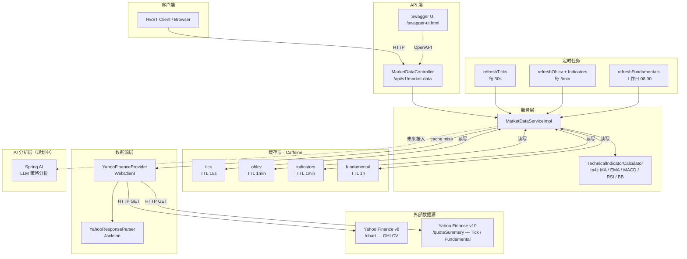

# Quantitative Trading Service

## 项目简介

本项目是基于 **Spring AI** 构建的量化交易服务，旨在将人工智能能力与量化交易策略深度融合，实现智能化的金融市场分析与自动化交易决策。

## 主要目标

- **AI 驱动的策略分析**：利用 Spring AI 集成大语言模型（LLM），对市场数据、新闻资讯及技术指标进行智能解读，辅助生成和优化交易策略。
- **量化策略引擎**：支持多种量化交易策略的开发、回测与执行，包括趋势跟踪、均值回归、套利等策略模型。
- **实时市场数据处理**：接入多源市场数据，进行实时行情监控、技术指标计算与信号生成。
- **风险管理**：内置仓位管理、止盈止损、最大回撤控制等风险控制机制。
- **自动化交易执行**：对接交易所或券商 API，实现订单的自动化生成与执行。

## 技术栈

| 技术 | 版本 | 说明 |
|------|------|------|
| Spring Boot | 4.1.0 | 应用框架 |
| Spring AI | 2.0.0 | AI 集成框架，连接 LLM 进行智能分析 |
| Java | 21 | 主要开发语言 |
| Spring WebFlux | — | WebClient 非阻塞 HTTP 调用 |
| Caffeine | 3.1.8 | 高性能内存缓存 |
| ta4j | 0.16 | 技术指标计算（MA/EMA/MACD/RSI/布林带） |
| springdoc-openapi | 2.8.6 | Swagger UI / OpenAPI 3.0 文档 |
| Yahoo Finance | v8/v10 | 免费市场数据源（无需 API Key） |
| JaCoCo | 0.8.12 | 代码覆盖率（最低 80%） |
| Gradle | 8.14 | 构建工具 |

## 核心模块（规划中）

- `market-data` — 市场数据采集与处理
- `strategy` — 量化策略定义与回测
- `ai-analysis` — Spring AI 驱动的智能分析
- `risk-management` — 风险控制模块
- `trading-executor` — 交易执行模块

## 技术架构



### 数据流说明

| 请求路径 | 流程 |
|---------|------|
| `GET /{symbol}/tick` | Controller → Service → Caffeine(15s TTL) → YahooFinanceProvider → Yahoo v10 |
| `GET /{symbol}/ohlcv` | Controller → Service → Caffeine(1min TTL) → YahooFinanceProvider → Yahoo v8 |
| `GET /{symbol}/indicators` | Controller → Service → 先取 OHLCV(200根) → ta4j 计算 → Caffeine(1min TTL) |
| `GET /{symbol}/fundamental` | Controller → Service → Caffeine(1h TTL) → YahooFinanceProvider → Yahoo v10 |
| `GET /batch/tick` | Controller → Service → 并行 parallelStream 查询多个 symbol |
| `POST /{symbol}/refresh` | Controller → Service → 清空缓存 → 预热全部数据 |

## 快速开始

```bash
# 克隆项目
git clone https://github.com/Robinbin/quantitative-trading-service.git
cd quantitative-trading-service

# 构建并运行测试
./gradlew build

# 启动服务（需设置 OPENAI_API_KEY 环境变量）
OPENAI_API_KEY=your-key ./gradlew bootRun
```

启动后访问：
- Swagger UI：http://localhost:8080/swagger-ui.html
- API 文档：http://localhost:8080/v3/api-docs
- 健康检查：http://localhost:8080/actuator/health

## 许可证

本项目仅供学习与研究使用。
